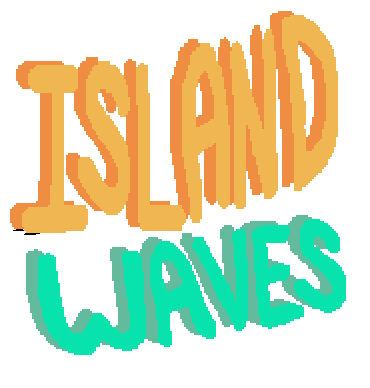

    

**Island Waves** is a multiplayer game of an aquatic brawl between islands. It was made in 48 hours for the [Global Game Jam 2017](http://globalgamejam.org/2017/games/island-waves-0), using the theme *waves*. 

Made by a group of friends in Asunción, 🇵🇾 with [Phaser](https://phaser.io/) and [socket.io](http://socket.io/).

The master branch will be updated in the future. If you want to check out the GGJ version check the [GGJ-freeze](https://github.com/berithpy/islandgamesggj/tree/GGJ-freeze) branch.

## Instructions

The game is meant to be served from a server. Host it from any HTTP server capable of serving static files. The root of the server should be at the root of the project. The index of the server will load the game.

An additional server is required for the multiplayer connection. This server requires [nodejs](https://nodejs.org) and is located in the **/server** directory. Install the server dependencies with **npm install**. Run with **node index**.
